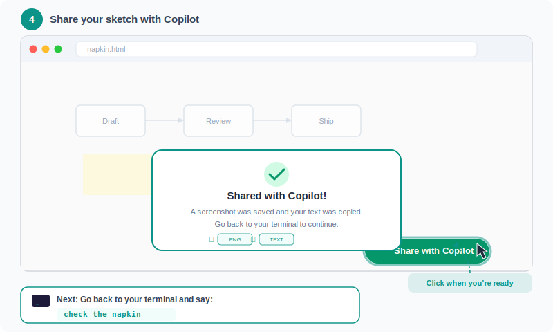
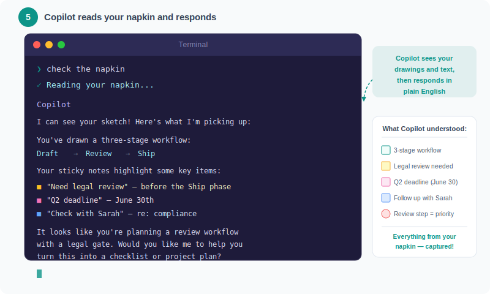

# Napkin — Visual Whiteboard for Copilot CLI

A whiteboard that opens in your browser and connects to Copilot CLI. Draw, sketch, add sticky notes — then share everything back with Copilot. Copilot sees your drawings and responds with analysis, suggestions, and ideas.

Built for people who aren't software developers: lawyers, PMs, business stakeholders, designers, writers — anyone who thinks better visually.

## Installation

Install the plugin directly from Copilot CLI:

```bash
copilot plugin install napkin@awesome-copilot
```

That's it. No other software, accounts, or setup required.

### Verify It's Installed

Run this in Copilot CLI to confirm the plugin is available:

```
/skills
```

You should see **napkin** in the list of available skills.

## How to Use It

### Step 1: Say "let's napkin"

Open Copilot CLI and type `let's napkin` (or "open a napkin" or "start a whiteboard"). Copilot creates a whiteboard and opens it in your browser.


### Step 2: Your whiteboard opens

A clean whiteboard appears in your browser with simple drawing tools. If it's your first time, a quick welcome message explains how everything works.


### Step 3: Draw and brainstorm

Use the tools to sketch ideas, add sticky notes, draw arrows between concepts — whatever helps you think. This is your space.


### Step 4: Share with Copilot

When you're ready for Copilot's input, click the green **Share with Copilot** button. It saves a screenshot and copies your notes.



### Step 5: Copilot responds

Go back to your terminal and say `check the napkin`. Copilot looks at your whiteboard — including your drawings — and responds.



## What's Included

### Skill

| Skill | Description |
|-------|-------------|
| `napkin` | Visual whiteboard collaboration — creates a whiteboard, interprets your drawings and notes, and responds conversationally |

### Bundled Assets

| Asset | Description |
|-------|-------------|
| `assets/napkin.html` | The whiteboard application — a single HTML file that opens in any browser, no installation needed |

## Whiteboard Features

| Feature | What it does |
|---------|-------------|
| **Freehand drawing** | Draw with a pen tool, just like on paper |
| **Shapes** | Rectangles, circles, lines, and arrows — wobbly shapes snap to clean versions |
| **Sticky notes** | Draggable, resizable, color-coded notes (yellow, pink, blue, green) |
| **Text labels** | Click anywhere to type text directly on the canvas |
| **Pan and zoom** | Hold spacebar and drag to move around; scroll to zoom |
| **Undo/Redo** | Made a mistake? Ctrl+Z to undo, Ctrl+Shift+Z to redo |
| **Auto-save** | Your work saves automatically — close the tab, come back later, it's still there |
| **Share with Copilot** | One button exports a screenshot and copies your text content |

## How Copilot Understands Your Drawings

When you click "Share with Copilot," two things happen:

1. **A screenshot is saved** (`napkin-snapshot.png` in your Downloads or Desktop folder). Copilot reads this image and can see everything — sketches, arrows, groupings, annotations, sticky notes, spatial layout.

2. **Your text is copied to clipboard.** This gives Copilot the exact text from your sticky notes and labels, so nothing gets misread from the image.

Copilot uses both to understand what you're thinking and respond as a collaborator — not a computer analyzing data, but a colleague looking at your whiteboard sketch.

## What Can You Draw?

Anything. But here are some things Copilot is especially good at interpreting:

| What you draw | What Copilot understands |
|---------------|------------------------|
| Boxes connected by arrows | A process flow or workflow |
| Items circled together | A group of related ideas |
| Sticky notes in different colors | Categories or priorities |
| Text with a line through it | Something rejected or deprioritized |
| Stars or exclamation marks | High-priority items |
| Items on opposite sides | A comparison or contrast |
| A rough org chart | Reporting structure or team layout |

## Keyboard Shortcuts

You don't need these — everything works with mouse clicks. But if you want to work faster:

| Key | Tool |
|-----|------|
| V | Select / move |
| P | Pen (draw) |
| R | Rectangle |
| C | Circle |
| A | Arrow |
| L | Line |
| T | Text |
| N | New sticky note |
| E | Eraser |
| Delete | Delete selected item (not yet supported) |
| Ctrl+Z | Undo |
| Ctrl+Shift+Z | Redo |
| Space + drag | Pan the canvas |
| ? | Show help |

## FAQ

**Do I need to install anything besides the plugin?**
No. The whiteboard is a single HTML file that opens in your browser. No apps, no accounts, no setup.

**Does it work offline?**
Yes. Everything runs locally in your browser. No internet connection needed for the whiteboard itself.

**What browsers work?**
Any modern browser — Chrome, Safari, Edge, Firefox. Chrome works best for the "copy to clipboard" feature.

**Can I save my work?**
Yes, automatically. The whiteboard saves to your browser's local storage every few seconds. Close the tab, come back later, your work is still there.

**Can Copilot really understand my drawings?**
Yes. The AI models powering Copilot CLI (Claude, GPT) can interpret images. They can see your sketches, read your handwriting-style text, understand spatial relationships, and interpret common visual patterns like flowcharts, groupings, and annotations.

**What if I'm not a good artist?**
Doesn't matter. The whiteboard snaps wobbly shapes to clean versions, and Copilot is trained to interpret rough sketches. Stick figures and messy arrows work just fine.

**How do I start over?**
Say "let's napkin" again in the CLI. Copilot will ask if you want to keep the existing whiteboard or start fresh.

**What platforms are supported?**
macOS, Linux, and Windows. The whiteboard runs in any browser. Clipboard integration uses platform-native tools (`pbpaste` on macOS, `xclip` on Linux, PowerShell on Windows).

## Source

This plugin is part of [Awesome Copilot](https://github.com/github/awesome-copilot), a community-driven collection of GitHub Copilot extensions.

## License

MIT
